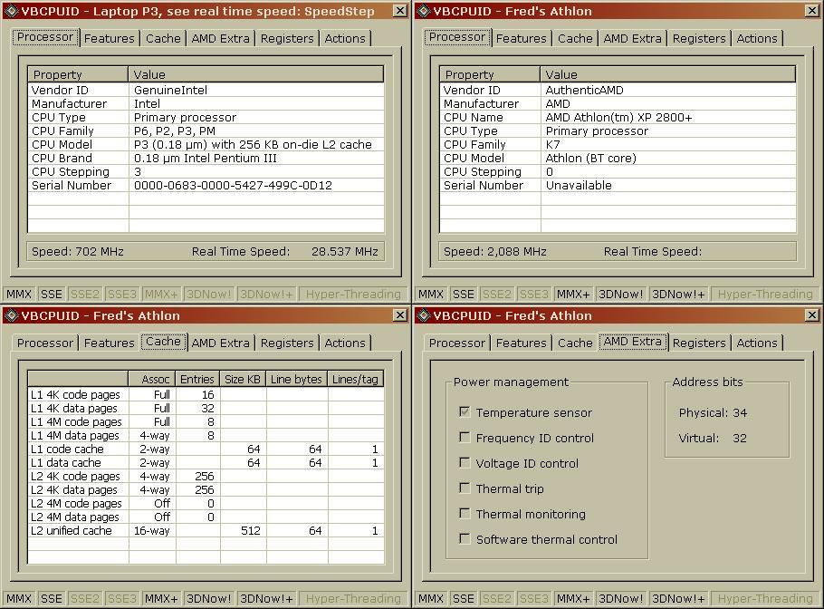



## UPDATED 10/21/03 \- Detect cpu make, model, features, cache, speed etc\.

### Description

x86 cpu's have the ability to self-report their make, model, family, features, cache details etc. The included cCPUID class allows the programmer to execute this instruction and retrieve the results. To abstract the complexities of decoding the CPUID data, the included cCpuInfo class presents the programmer with a series of read-only properties. As an example of this, the included VBCPUID application displays the information presented by the cCpuInfo class.

If you are wondering why the 'Real Time Speed' display - try running the VBCPUID app on a SpeedStep cpu.

If you own an unusual cpu, such as an Athlon 64/Opteron, Cyrix etc... I'd be gratefull if you'd go to the 'Actions' tab, 'Save Data...' and email the file to me.
 
### More Info
 

             |
---                |---
**Submitted On**   |2003-10-20 18:23:32
**By**             |[Paul Caton](https://github.com/Planet-Source-Code/PSCIndex/blob/master/ByAuthor/paul-caton.md)
**Level**          |Advanced
**User Rating**    |4.9 (262 globes from 53 users)
**Compatibility**  |VB 6\.0
**Category**       |[Miscellaneous](https://github.com/Planet-Source-Code/PSCIndex/blob/master/ByCategory/miscellaneous__1-1.md)
**World**          |[Visual Basic](https://github.com/Planet-Source-Code/PSCIndex/blob/master/ByWorld/visual-basic.md)
**Archive File**   |[UPDATED\_1016615310212003\.zip](https://github.com/Planet-Source-Code/paul-caton-updated-10-21-03-detect-cpu-make-model-features-cache-speed-etc__1-49073/archive/master.zip)

